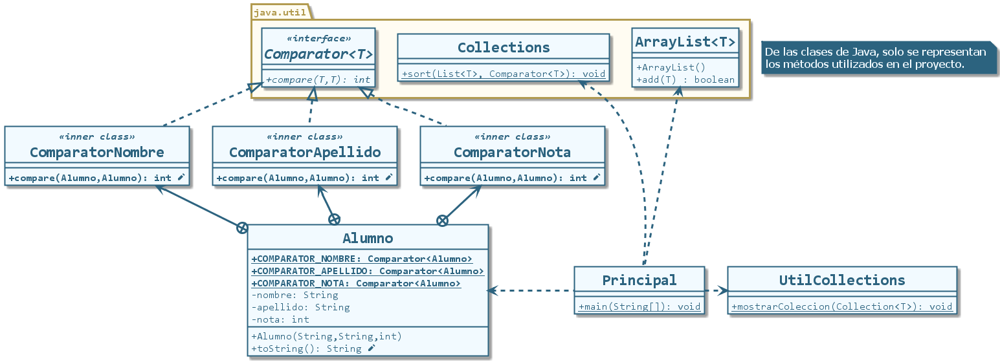

# Interfaz 'Comparator<T>' en Java

## Descripción

Proyecto que ejemplifica el uso de la interfaz genérica 'Comparator<T>', que permite tener objetos que la implementen para poder pasar a ser 'Comparadores'. Objetos de este tipo son requeridos para saber cómo ordenar elementos de determinado tipo en una colección, sin que éstos sean comparables.

## Diagrama de clases

Proyecto realizado con NetBeans. Puede abrirse con Eclipse.